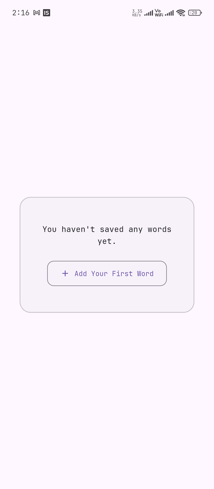
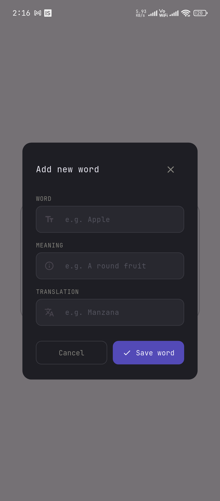
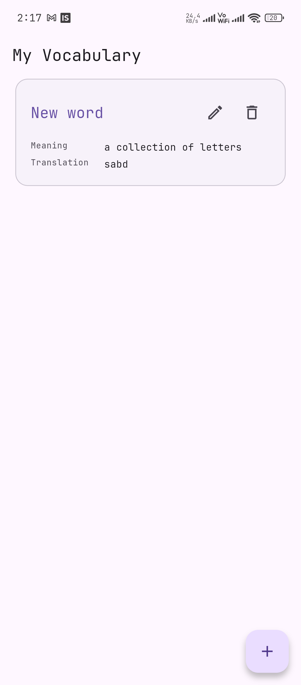
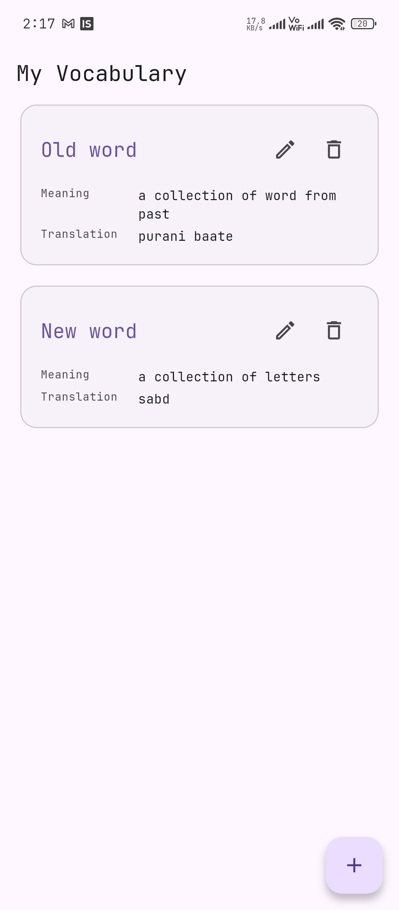

# LingoBreeze – My Vocabulary

A single-feature language-learning app that lets users save vocabulary words and view them in a clean list.

## Project Structure

```
lingobreeeze/
├── flutter-app/          ← Flutter mobile app
├── backend/              ← Node.js + Express API
├── pictures/             ← Screenshots
└── README.md
```

---

## Backend Setup

```bash
cd backend
cp .env.example .env
# Edit .env with your service account path:
#   GOOGLE_APPLICATION_CREDENTIALS=./service-account.json

npm install
npm run dev
```

Server runs at `http://localhost:3000`.

### Endpoints

| Method | Path            | Description      |
| ------ | --------------- | ---------------- |
| GET    | `/health`       | Health check     |
| GET    | `/words`        | List all words   |
| POST   | `/words`        | Add a word       |
| PUT    | `/words/:id`    | Update a word    |
| DELETE | `/words/:id`    | Delete a word    |

---

## Flutter App Setup

```bash
cd flutter-app

# Install dependencies
flutter pub get

# Run (choose one):
flutter run -d chrome          # Web
flutter run                    # Connected device / emulator
```

> **Note:** The app reads from the Node API. Update the API URL in `lib/riverpod/providers.dart` to match your machine's local IP (e.g. `http://192.168.1.17:3000` for a physical phone, or `http://10.0.2.2:3000` for Android emulator).

---

## Firebase Configuration

1. Create a project at [Firebase Console](https://console.firebase.google.com)
2. Enable **Firestore Database** (test mode)
3. **Android:** Add Android app → download `google-services.json` → place in `flutter-app/android/app/`
4. **Service Account:** Generate a private key (Project Settings → Service accounts) → save as `backend/service-account.json`
5. Reference the key in `backend/.env`:
   ```
   GOOGLE_APPLICATION_CREDENTIALS=./service-account.json
   ```
6. Firestore collection: `words` with fields `word`, `meaning`, `translation` (all strings)

---

## Testing

```bash
cd flutter-app
flutter test test/vocab_word_test.dart
```

---

## Screenshots

| Empty State | Add Word Dialog | One Word | Two Words |
|-------------|----------------|----------|-----------|
|  |  |  |  |

---

## AI Contribution Estimate

```
UI: 40%
Backend: 30%
Architecture: Manual
```
